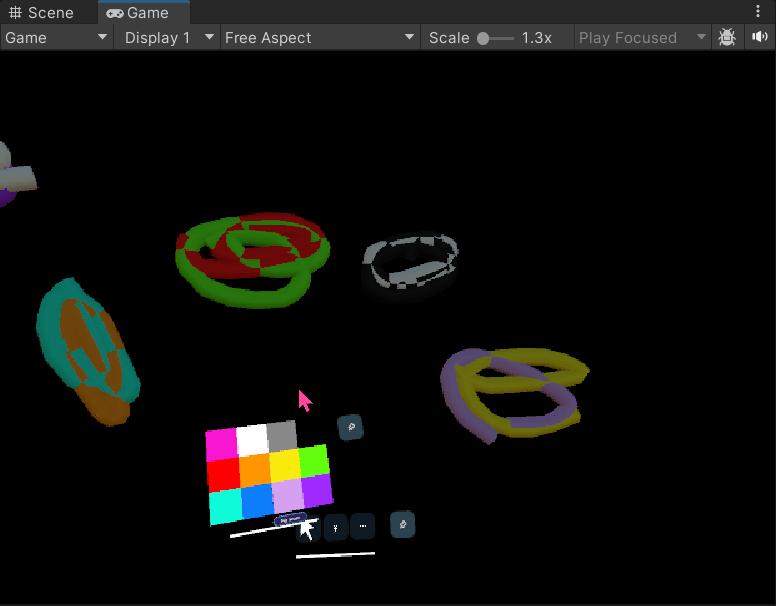
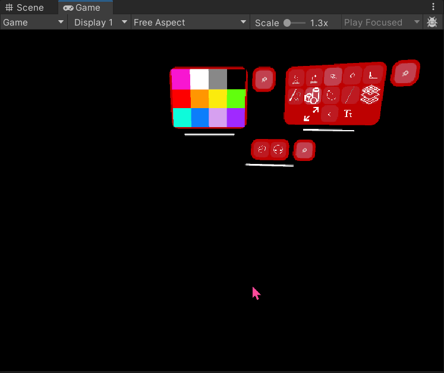

# Welcome to the AR Mural 

Welcome to the documentation for our **Augmented Reality Drawing Application**, developed with Unity and HoloLens. This site will guide you through the tools, architecture, and setup needed to understand, extend, or contribute to the project.

  

---

## 🔧 What Is This Project?

This is a collaborative Unity-based AR platform that allows users to draw in 3D space using the Microsoft HoloLens. The application supports multiple drawing tools, image and text placement, and object interaction in a spatially aware environment.

---

## 🚀 Features

- 🖌️ Multiple drawing tools (brush, shape, line)
- 🧽 Erasing and object selection
- 🖼️ Image insertion and 3D object handling
- ⌨️ In-AR text input
- 📦 Modular and extendable tool system

---

## 🛠️ Tech Stack

- Unity 2022+
- MRTK (Mixed Reality Toolkit)
- C# scripting
- Microsoft HoloLens 2
- MkDocs for documentation

---

## 📸 Demo Murals

### Drawing in Action
  

### Shapes
  

---

## 📚 Start Exploring

Use the sidebar or the links below to dive into the documentation:

- [Tool Overview](tool_scripts.md)

---

