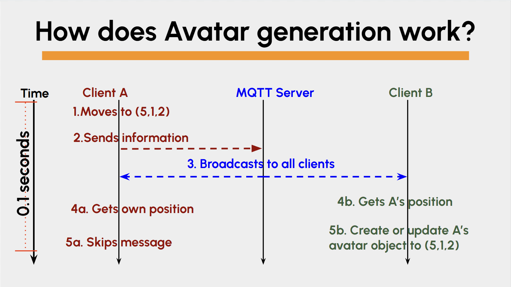

This section covers **manager scripts**. In this project, manager scripts act as the control center for different high-level systems. Rather than handling logic in individual tools or UI components, managers oversee global coordination, such as which tool is active, how the UI behaves, or what object is selected. These scripts ensure the app behaves consistently and modularly, making it easier to scale and maintain. 

Having this hierarchy allows other scripts to do their job *without* having to worry about the big picture. For example, the `BrushTool` just draws, but how do we know when do enable it? Thats where manager scripts come into play. 

---

## **State Manager**
The `StateManager` is a centralized script that controls which drawing tool mode is active at any given time and manages the currently selected object in the AR space. It also handles user interactions like selecting, deleting, or duplicating objects. This script is key to keeping tool behavior modular and transitions clean between tools.

### **Singleton Pattern**
```csharp title="csharp"
public static StateManager Instance;

private void Awake()
{
    Instance = this;
}
```
As mentioned in the **Tool Scripts** section, `StateManager` follows a singleton pattern so other scripts can easily access it and ensures there is only one StateManager.

### **Mode Management**
The manager keeps track of which tool mode is active (brush, line, shape, erase, etc.) and enables/disables them accordingly.
```csharp title="csharp"
public void SwitchMode(ToolType newMode)
{
    DisableMode(mode);
    mode = newMode;
    EnableMode(mode);
}
```
This structure allows only one tool to be active at a time. It turns off the current tool, switches the mode, and activates the new one.

## **Avatar Manager**
`Avatar Manager` handles avatar creation by communicating with the MQTT server and serializing posiitonal data so the avatar can be recreated on remote clients. 

 
This diagram illustrates how our avatar generation system works with the MQTT server. Let's trace through what happens when one of these messages is sent from Client A:

1. Client A moves to a new position in their world - let's say coordinates **(5, 1, 2)**. 
2. Client A then sends this position update to the MQTT server, including their client ID, coordinates, and mural ID. 
3. The MQTT server broadcasts this message to **ALL subscribed clients** - this includes Client B (watching) and even Client A (the sender). 
4. Client A also receives the same message back from the server.
5. Client B receives the message containing Client A's position data.  
6. Client A skips the message because the client ID matches their own - they don't create an avatar for themselves.
7. Client B processes the message: checks the client ID, sees it's from Client A (not themselves), and either creates a new red avatar for Client A or updates the existing one to position (5, 1, 2).  Now Client B now sees Client A's avatar move to the new position in real-time. 

This happens continuously, 10 times per second for every connected client.

### **Avatar Data**
This is a serializable class that defines the data we want to send over to be broadcasted to other clients.
```csharp title='C#'
[Serializable]
public class AvatarData
{
    public string clientID;
    public float x, y, z;
    public string username;

    public int muralId;
}
```
This contains the users position, their chosen username, their client ID when they connected to the server (how we identify specific users), and what mural they are in. Each client is going to send their own AvatarData package 10 times a second.

### **Update()**
```csharp title='C#'
public void Update()
{
    if (string.IsNullOrEmpty(myClientID) || trackingTarget == null)
        return;

    if (Time.time - lastSendTime >= (1f / sendRate))
    {
        SendMyPosition();
        lastSendTime = Time.time;
    }
}
```
This method is called every frame to send the local player's position at a fixed rate (chosen from the serializable variable `sendRate`).

### **SendMyPosition()**
```csharp title="C#"
private void SendMyPosition()
{
    if (ClientManager.Instance == null || !ClientManager.Instance.connected)
        return;

    Vector3 pos = trackingTarget.position;
    string username_local = "Default";

    GameObject obj = GameObject.FindWithTag("Username");
    if (obj != null)
    {
        UsernameManager = obj;
        GetUsername getUsername = UsernameManager.GetComponent<GetUsername>();
        if (getUsername != null && !string.IsNullOrEmpty(getUsername.inputText))
        {
            username_local = getUsername.inputText;
        }
    }

    var avatarData = new AvatarData
    {
        clientID = myClientID,
        x = pos.x,
        y = pos.y,
        z = pos.z,
        username = username_local,
        muralId = currentMuralId
    };

    _ = ClientManager.Instance.SendAvatarUpdate(avatarData);
}
```
Packages the local user's position, username, and mural ID into an `AvatarData` object and forwards it to `ClientManager` for network transmission. This method is called periodically in `Update()` based on `sendRate`. `SendAvatarUpdate` is a method in `ClientManager` that configures the topic and message and actually publishes it to the broker.

### **StartHeartbeatChecker()**
```csharp title="C#"
private async Task StartHeartbeatChecker()
{
    while (isRunning && this != null)
    {
        await Task.Delay((int)(heartbeatCheckInterval * 1000));
        if (!isRunning) break;
        unitySyncContext.Post(_ => CheckForTimedOutClients(), null);
    }
}
```
This method starts a background task that checks every heartbeatCheckInterval seconds for avatars that haven't updated in a while.

### **CheckForTimedOutClients()**
```csharp title="C#"
private void CheckForTimedOutClients()
{
    float currentTime = Time.time;
    var clientsToRemove = new List<string>();

    foreach (var kvp in lastHeartbeatTime)
    {
        string clientID = kvp.Key;
        float lastTime = kvp.Value;

        if (clientID == myClientID) continue;

        if (currentTime - lastTime > heartbeatTimeout)
        {
            Debug.Log($"[AvatarManager] Client {clientID} timed out");
            clientsToRemove.Add(clientID);
        }
    }

    foreach (string clientID in clientsToRemove)
    {
        RemoveAvatar(clientID);
    }
}
```
Removes avatars that haven't sent a heartbeat update within `heartbeatTimeout` seconds. It looks through the dictionary in `lastHeartbeatTime` and if the last heartbeat they sent was larger than `heartbeatTimeout` (which is a serializable variable that you can configure), the avatar is classified as "inactive" and is removed. 

### **UpdateRemoteAvatar(AvatarData data)**
```csharp title="C#"
private void UpdateRemoteAvatar(AvatarData data)
{
    Vector3 newPosition = new Vector3(data.x, data.y, data.z);

    if (remoteAvatars.ContainsKey(data.clientID))
    {
        GameObject avatar = remoteAvatars[data.clientID];
        if (avatar != null)
        {
            avatar.transform.position = newPosition;
        }
        else
        {
            remoteAvatars.Remove(data.clientID);
            lastHeartbeatTime.Remove(data.clientID);
        }
    }
    else
    {
        CreateNewAvatar(data.clientID, newPosition, data.username);
    }
}
```
Creates or updates a remote avatar based on the incoming AvatarData. If the avatar already exists, its position is updated; otherwise, a new one is instantiated.

### **CreateNewAvatar(string clientID, Vector3 position, string username)**
```csharp title="C#"
private void CreateNewAvatar(string clientID, Vector3 position, string username)
{
    if (avatarPrefab == null)
    {
        Debug.LogError("[AvatarManager] Avatar prefab is not assigned!");
        return;
    }

    GameObject newAvatar = Instantiate(avatarPrefab, position, Quaternion.identity);
    newAvatar.name = $"Avatar_{clientID}";

    Transform canvas = newAvatar.transform.GetChild(0).GetChild(0); 
    TextMeshPro tmp = canvas.GetComponent<TextMeshPro>();
    tmp.text = username;

    remoteAvatars[clientID] = newAvatar;

    Debug.Log($"[AvatarManager] Created new avatar for {clientID} at {position}");
}
```
Instantiates a new avatar prefab in the scene and sets the username label using TextMeshPro.

### **HandleAvatarUpdate(AvatarData data)**
```csharp title="C#"
public void HandleAvatarUpdate(AvatarData data)
{
    if (data.muralId != currentMuralId)
    {
        Debug.Log($"[AvatarManager] Ignoring avatar from mural {data.muralId}, currently on mural {currentMuralId}");
        return;
    }

    unitySyncContext.Post(_ =>
    {
        lastHeartbeatTime[data.clientID] = Time.time;
        UpdateRemoteAvatar(data);
    }, null);
}
```
This method processes incoming avatar data and filters out updates from other murals. It keeps track of the time the user updated the avatar position and calls `UpdateRemoteAvatar`. `UnitySyncContext` is used to safely invoke Unity methods on the main thread from async tasks.

### **RemoveAvatar(string ClientID)**
```csharp title="C#"
public void RemoveAvatar(string clientID)
{
    if (remoteAvatars.ContainsKey(clientID))
    {
        GameObject avatar = remoteAvatars[clientID];
        if (avatar != null){
            Destroy(avatar);
        } 
        remoteAvatars.Remove(clientID);
    }
    lastHeartbeatTime.Remove(clientID);
}
```
Given a clientID, this method goes through the `remoteAvatars` dictionary which pairs the avatar GameObject with a specific clientID, destroys the avatar GameObject, and removes the clientID from the relevant dictionaries.

### **ClearAllAvatars()**
```csharp title="C#"
public void ClearAllAvatars()
{
    foreach (var kvp in remoteAvatars)
    {
        if (kvp.Value != null)
            Destroy(kvp.Value);
    }
    remoteAvatars.Clear();
    lastHeartbeatTime.Clear();
}
```
This method destroys all avatar GameObjects and resets tracking. It's necessary when switching murals into a new "world".

### **OnMuralSwitch(int newMuralID)**
```csharp title="C#"
public void OnMuralSwitch(int newMuralId)
{
    if (ClientManager.Instance != null && ClientManager.Instance.connected)
    {
        _ = SendDisconnectMessage();
    }

    ClearAllAvatars();
    currentMuralId = newMuralId;
}
```
Handles switching murals by sending disconnect, clearing old avatars, and updating the current mural ID.

### **SendDisconnectMessage()**
```csharp title="C#"
private async Task SendDisconnectMessage()
{
    if (ClientManager.Instance == null || !ClientManager.Instance.connected)
        return;

    var disconnectData = new AvatarData
    {
        clientID = myClientID,
        x = 0,
        y = 0,
        z = 0,
        username = "DISCONNECT",
        muralId = currentMuralId
    };

    string json = JsonConvert.SerializeObject(disconnectData);
    var message = new MqttApplicationMessageBuilder()
        .WithTopic($"mural_{currentMuralId}/avatar/disconnect")
        .WithPayload(json)
        .WithQualityOfServiceLevel(MQTTnet.Protocol.MqttQualityOfServiceLevel.AtMostOnce)
        .Build();

    await ClientManager.Instance.mqttClient.PublishAsync(message);
}
```
Sends a "DISCONNECT" message through MQTT when the user leaves a mural or the app, which notifies other clients that this user has left. 


