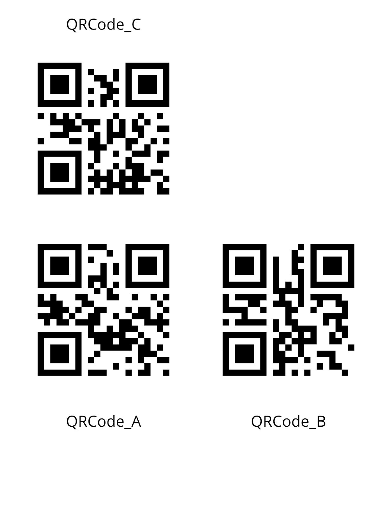

When we started working on the project we noticed that in order for two users in the same room to see objects at the same position they needed to initialize the Hololens at the exact same place. We also wanted a way for users from different locations to have access to the same scene. In order to fix these problems we thought of using QRCodes as a spatial anchor. Now users have to scan three specific QRCodes to see objects and avatars appear at their right position.

## **How does it work?**
This system distinguishes if the user is using the application from an Hololens headset or just trying to debug it from the Unity editor. Because we don’t apply any modification of positions and coordinates if we are inside the Unity editor since we can’t scan QRCodes from there. 

If the user is using Hololens we delay the ActualStart() function that is normally called when we launch the main scene. Inside the script UserPositionFromQR we wait for the user to scan three specific QRCodes that together create a 3D frame:

- QRCode_A is considered the origin of the coordinate system.
- QRCode_B defines the horizontal (X) direction.
- QRCode_C, together with A and B, defines the vertical (Y) axis by forming an orthogonal basis.

When the QR codes are detected, we compute a transformation matrix that maps virtual content into the real-world space based on the relative positions of the QR codes. This matrix is then used to reposition all the objects that are recreated in the function QueryResponse in the script JustMonika. 
Each object created while using the hololens must also be repositioned correctly for others to see it exactly where it was created but we are still working on that.

We also use this matrix to reposition the avatars. Every coordinate that we send to the server is in Unity coordinates, so every user needs to translate the position they receive from others into their own QRCode frame using the transform matrix. In the same way our position that we broadcast to others needs to be translated back using the inverse of the matrix. That way we make sure that users are evolving into the same frame. 

## **QR Code Reference Sheet**
 

